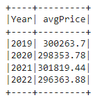
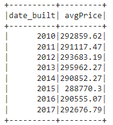
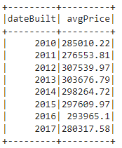
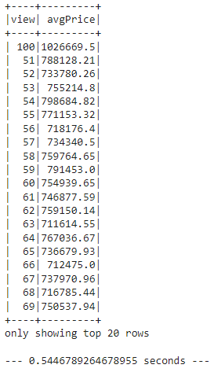
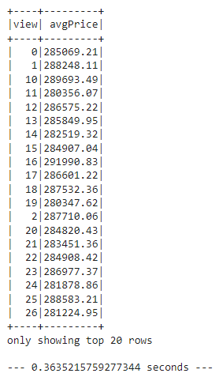
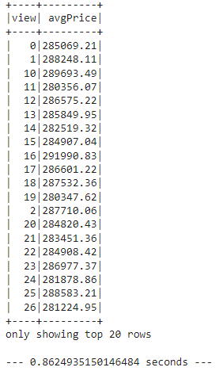

# BootCamp_Home_Sales

1. Rename the Home_Sales_starter_code.ipynb file as Home_Sales.ipynb.

2. Import the necessary PySpark SQL functions for this assignment.

3. Read the home_sales_revised.csv data in the starter code into a Spark DataFrame.

    ```python
    # 1. Read in the AWS S3 bucket into a DataFrame.
    from pyspark import SparkFiles
    url = "https://2u-data-curriculum-team.s3.amazonaws.com/dataviz-classroom/v1.2/22-big-data/home_sales_revised.csv"
    spark.sparkContext.addFile(url)
    df = spark.read.csv(SparkFiles.get("home_sales_revised.csv"), sep=",", header=True)
    df.show()
    ```

4. Create a temporary table called home_sales.

    ```python
    # 2. Create a temporary view of the DataFrame.
    df.createOrReplaceTempView('home_sales')
    ```

5. Answer the following questions using SparkSQL:

    - What is the average price for a four-bedroom house sold for each year? Round off your answer to two decimal places.

        

    - What is the average price of a home for each year it was built that has three bedrooms and three bathrooms? Round off your answer to two decimal places.

        

    - What is the average price of a home for each year that has three bedrooms, three bathrooms, two floors, and is greater than or equal to 2,000 square feet? Round off your answer to two decimal places.

        

    - What is the "view" rating for homes costing more than or equal to $350,000? Determine the run time for this query, and round off your answer to two decimal places.

        

6. Cache your temporary table home_sales.

    ```python
    # 7. Cache the the temporary table home_sales.
    spark.sql('cache table home_sales')
    ```

7. Check if your temporary table is cached.

    ```python
    # 8. Check if the table is cached.
    spark.catalog.isCached('home_sales')
    ```

8. Using the cached data, run the query that filters out the view ratings with an average price of greater than or equal to $350,000. Determine the runtime and compare it to uncached runtime.

    

9. Partition by the "date_built" field on the formatted parquet home sales data.

    ```python
    # 10. Partition by the "date_built" field on the formatted parquet home sales data
    df.write.partitionBy('date_built').mode('overwrite').parquet('home_sales_partitioned')
    ```

10. Create a temporary table for the parquet data.

    ```python
    # 12. Create a temporary table for the parquet data.
    df_p.createOrReplaceTempView('home_sales_p')
    ```

11. Run the query that filters out the view ratings with an average price of greater than or equal to $350,000. Determine the runtime and compare it to uncached runtime.

    

12. Uncache the home_sales temporary table.

    ```python
    # 14. Uncache the home_sales temporary table.
    spark.sql('uncache table home_sales')
    ```

13. Verify that the home_sales temporary table is uncached using PySpark.

    ```python
    # 15. Check if the home_sales is no longer cached
    spark.catalog.isCached('home_sales')
    ```